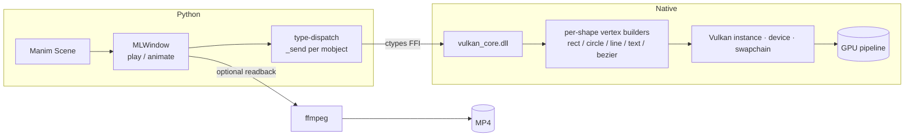

# Real-Time-Manim(RTM)

<p align="center">
  
</p>
A Vulkan-accelerated, real-time rendering backend for
[ManimCE](https://www.manim.community/). Instead of the default OpenGL/Cairo
renderer, `real-time-manim` draws every scene through a native Vulkan pipeline —
so you get a live, interactive window *and* fast GPU-accelerated video output,
all driven by ordinary Manim scenes.

> RTM(Real-Time-Manim) is a vulkan-based manim renderer boosting manim speed, making live-rendering available and compatible for rendering manim. Previous manim render focusing on Opengl ang Cairo renderer is CPU-based, making graphic rendering extremely slow and live-interaction unfeasible. RTM uses a refactored render pipeline (see flow chart below) to make live-render available for math animation, preparing for further development of Manteraction(a app for live interaction manim video creation, animation, and interaction.)


> **Audience.** This README is a short, user-facing guide. For the full picture —
> architecture, rendering internals, the animation system and building from
> source — see the [Wiki](https://github.com/BEGINWITHF/real-time-manim/wiki).

---

## Highlights

- **Live window.** Render Manim scenes in real time inside a `MLWindow`, not just
  to a rendered file.
- **GPU backend.** A bundled `vulkan_core.dll` replaces the Cairo/OpenGL raster
  path with a Vulkan vertex pipeline (rects, circles, lines, beziers, text, …).
- **One-line video capture.** `fast_record_scene(...)` records a scene to an MP4
  — offline and windowless by default — and `record_scene(...)` records against
  a live window. Output defaults to `~/Downloads`.
- **Auto-cleanup.** Transient `media/` artefacts are removed for you after a run.
- **LaTeX caching.** `Tex`/`MathTex` scenes reuse compiled SVGs so unchanged math
  is never recompiled.
- **All Manim Animations Supported** — everything mentioned in the "Animation" part in manim community is supported(we are going to support other features in the future).

---

## Install

real-time-manim is published to **PyPI**. With any Python 3.11+ on Windows
10/11:

```bash
pip install real-time-manim
```

The Windows wheel bundles everything you need to render (`vulkan_core.dll` and
the window icon), so no separate build step is required.

**macOS** is supported as well: the renderer loads a `vulkan_core.dylib` instead
of the Windows DLL, so build that once from source first:

```bash
brew install molten-vk          # MoltenVK provides the Vulkan layer on macOS
bash native/build_mac.sh        # -> dist/release/vulkan_core.dylib
```

Then install the package (from PyPI or this repo) and run as usual. See
[Building the DLL](https://github.com/BEGINWITHF/real-time-manim/wiki/Building-the-DLL)
for details.

> **Prerequisites at runtime:** a Vulkan-capable GPU/driver, and `ffmpeg` on your
> `PATH` if you want to record video.

---

## Quick start

Write a normal Manim `Scene`, open a window, and play. Then **record it to
`~/Downloads` with a single call**:

```python
from manim import Scene, Square, BLUE
from real_time_manim.vulkan_bind import MLWindow, Create, Wait
from real_time_manim.record import fast_record_scene

class Hello(Scene):
    def construct(self):
        win = MLWindow(960, 540)     # a real-time window opens
        win.scene = self
        sq = Square(side_length=1.5, color=BLUE).set_fill(BLUE, 0.6)
        win.play(Create(sq), run_time=1.0)
        win.play(Wait(0.5))
        win.close()

fast_record_scene(Hello)             # → C:\Users\<you>\Downloads\output.mp4
```

That's it — recording starts and stops around the scene automatically, and the
transient `media/` folder is cleaned up afterwards.

---

## Core concepts

### `MLWindow` — the live renderer

`MLWindow(w, h)` opens a real-time Vulkan window. Inside a scene you bind it and
drive it with Manim animations:

```python
render = MLWindow(1280, 720)
render.scene = scene                 # bind the Manim scene
render.play(Create(sq))              # play any supported animation
render.close()
```

`render.play(...)` takes the same animations and keyword arguments you would pass
to Manim's `Scene.play` (`run_time`, `lag_ratio`, `rate_func`, …).

### Two recorders (`real_time_manim.record`)

| Function | Mode | Behaviour |
|----------|------|-----------|
| `fast_record_scene(scene, out_path=None, *, fps=60, hidden=True, overwrite=True, cleanup=True)` | offline | Fast framebuffer readback piped straight to ffmpeg. **No window** by default; runs at full speed. |
| `record_scene(scene, out_path=None, *, fps=60, overwrite=True, cleanup=True)` | real-time | Captures a **live, visible** window in a background thread. |

Both accept a `Scene` subclass, a `Scene` instance, or a no-arg callable, and
return a dict `{out_path, windows, files}`. When `out_path` is omitted, output
lands at `~/Downloads/output.mp4` (a scene opening several windows gets
`_part2`, `_part3`, … suffixes). `cleanup=True` (default) deletes transient
manim `media/` after the run; set `cleanup=False` to keep it.

```python
fast_record_scene(MyScene)                       # ~/Downloads/output.mp4
fast_record_scene(MyScene, "preview.mp4")        # current dir, or pass a full path
fast_record_scene(MyScene, fps=60, hidden=False) # show the window while capturing
record_scene(MyScene, "live.mp4", fps=30)        # record against a live window
```

### LaTeX cache helpers (`real_time_manim.util`)

Rendering `MathTex`/`Tex` compiles each formula to an SVG. Cache the results so
unchanged math is reused instead of recompiled on every run:

```python
from real_time_manim.util import restore_tex_cache, save_tex_cache

restore_tex_cache("tex_cache")   # before rendering: warm manim's SVG dir
# ... run your Tex scene(s) ...
save_tex_cache("tex_cache")      # after: stash newly compiled SVGs
```

All helpers take explicit `media_dir`/`tex_subdir`, `only_ext`, `overwrite`,
`dry_run` and `verbose` knobs. `clear_media()` force-removes the transient media
folder (used automatically by the recorders).

---

## Animations

Import animations from `real_time_manim.vulkan_bind` (they re-export the
`real_time_manim.animations` package):

```python
from real_time_manim.vulkan_bind import (
    Create, Write, Transform, ReplacementTransform,
    FadeIn, FadeOut, FadeTransform, GrowFromCenter,
    Rotate, Rotating, ...
)
```

Highlights across categories:

- **Transforms** — `Transform`, `ReplacementTransform`, `FadeTransform`,
  `TransformMatchingShapes`, `TransformMatchingTex`
- **Drawing** — `Create`, `Uncreate`, `DrawBorderThenFill`,
  `ShowIncreasingSubsets`, `SpiralIn`
- **Fading** — `FadeIn`, `FadeOut`
- **Movement / scaling** — `MoveToTarget`, `MoveAlongPath`, `GrowFromCenter`,
  `GrowFromEdge`, `GrowFromPoint`, `GrowArrow`, `SpinInFromNothing`
- **Text** — `Write`, `Unwrite`, `TypeWithCursor`, `UntypeWithCursor`
- **Rotation** — `Rotate`, `Rotating`
- **Effects** — `ApplyWave`, `Circumscribe`, `Indicate`, `ShowPassingFlash`,
  `Blink`, `Homotopy`
- **Grouping / timing** — `AnimationGroup`, `Succession`

---

## How it works (in brief)



1. A `Scene` builds mobjects and calls `MLWindow.play(...)`.
2. The Python layer traverses the mobject tree and dispatches each shape to a
   type-specific sender.
3. Shapes cross a `ctypes` boundary into `vulkan_core.dll`, which emits vertices
   and submits them to a Vulkan pipeline.
4. Each frame is presented to the window — and can optionally be read back and
   piped to `ffmpeg` as an MP4.

Full details (frame lifecycle, coordinate system, animation internals, shape→DLL
mapping, build steps) live in the [Wiki](https://github.com/BEGINWITHF/real-time-manim/wiki).

---

## Repository layout

```
real-time-manim/
├── real_time_manim/            # the Python package
│   ├── vulkan_bind.py          #   MLWindow + record hooks (main bridge)
│   ├── record.py               #   one-call recorders (fast / real-time)
│   ├── util.py                 #   LaTeX cache + forced media cleanup
│   ├── vulkan_shapes.py        #   shape-specific senders
│   ├── vulkan_text.py          #   text / bezier rendering
│   ├── rate_functions.py       #   easing functions
│   ├── animations/             #   ~40 animation modules
│   └── utils/
├── native/                     # C/C++ Vulkan engine (vulkan_core.dll source)
├── logo.*                      # project logos
└── pyproject.toml
```

---

## Documentation & Wiki

- **[Home](https://github.com/BEGINWITHF/real-time-manim/wiki)** — overview and navigation
- **[Architecture](https://github.com/BEGINWITHF/real-time-manim/wiki/Architecture)** — layers and data flow
- **[Getting Started](https://github.com/BEGINWITHF/real-time-manim/wiki/Getting-Started)** — install, run, record
- **[API Reference](https://github.com/BEGINWITHF/real-time-manim/wiki/API-Reference)** — `MLWindow`, animations,
  recorders, cache helpers
- **[Animation Reference](https://github.com/BEGINWITHF/real-time-manim/wiki/Animation-Reference)** — supported animations
  with runnable examples
- **[Recording](https://github.com/BEGINWITHF/real-time-manim/wiki/Recording)** — recorders in depth
- **[Math Rendering](https://github.com/BEGINWITHF/real-time-manim/wiki/Math-Rendering)** — LaTeX vs. native Unicode mode
- **[Building the DLL](https://github.com/BEGINWITHF/real-time-manim/wiki/Building-the-DLL)** — compile `vulkan_core.dll`
- **[Internals](https://github.com/BEGINWITHF/real-time-manim/wiki/Internals)** — rendering pipeline, shape dispatch,
  design decisions

---

## License

[MIT](LICENSE) © real-time-manim contributors.

## Acknowledgments

- [ManimCE](https://www.manim.community/) — the mathematical animation engine
- [stb_truetype](https://github.com/nothings/stb) — TrueType font rasterizer
- [Vulkan](https://www.vulkan.org/) — the graphics API
